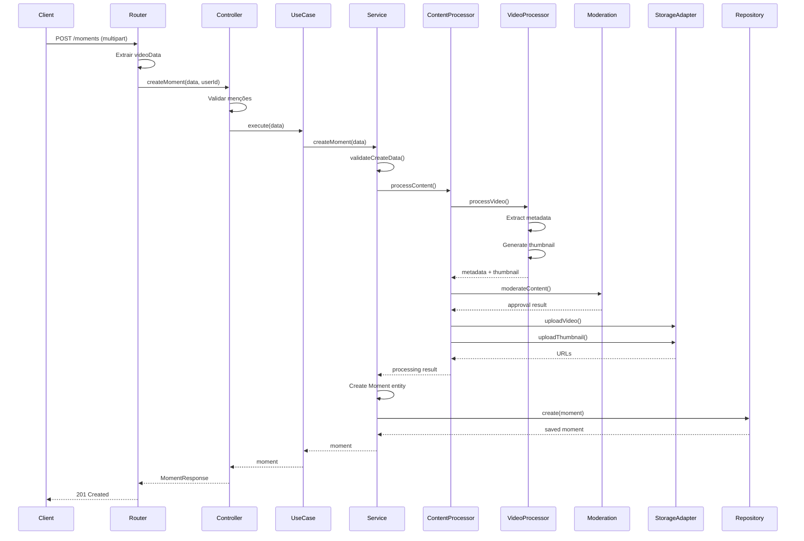

# Fluxo de Criação de Moment

Este documento descreve o fluxo completo de criação de um moment (vlog) no Circle System.

## Arquitetura em Camadas

```
Router (HTTP) → Controller → Use Case → Service → Content Processor → Storage/Moderation
```

## Fluxo Detalhado

### 1. Router (`moment.router.ts`)

**Responsabilidade**: Receber requisição HTTP e extrair dados

```typescript
POST /moments
Content-Type: multipart/form-data

// Campos do form-data:
- video: arquivo de vídeo (Buffer)
- filename: nome do arquivo
- mimeType: tipo MIME (ex: video/mp4)
- description: descrição opcional
- hashtags: array de hashtags (JSON)
- mentions: array de menções (JSON)
- location: localização (JSON opcional)
- device: informações do dispositivo (JSON opcional)
```

**Validações no Router**:

-   Extrai videoData do multipart
-   Parse de campos JSON (hashtags, mentions, location, device)
-   Passa dados para o Controller

### 2. Controller (`moment.controller.ts`)

**Responsabilidade**: Validação inicial e orquestração

**Validações**:

-   ✅ videoData não pode ser vazio
-   ✅ videoMetadata obrigatório
-   ✅ **Usuário não pode mencionar a si mesmo**
-   ✅ Chama o Use Case

```typescript
await this.createMomentUseCase.execute({
    ownerId: userId,
    videoData: Buffer,
    videoMetadata: { filename, mimeType, size },
    description: string,
    hashtags: string[],
    mentions: string[],
    location?: { latitude, longitude },
    device?: { type, os, model, ... }
})
```

### 3. Use Case (`create.moment.use.case.ts`)

**Responsabilidade**: Lógica de negócio

-   Chama o Service para processar o moment
-   Retorna resultado estruturado

### 4. Service (`moment.service.ts`)

**Responsabilidade**: Orquestração principal

**Validações no Service**:

-   ✅ ownerId obrigatório
-   ✅ videoData não vazio
-   ✅ videoMetadata completo
-   ✅ mimeType deve começar com "video/"
-   ✅ Descrição: máx 1000 caracteres
-   ✅ Hashtags: máx 30
-   ✅ Menções: máx 50
-   ✅ **Usuário não pode mencionar a si mesmo**
-   ✅ Sem menções duplicadas
-   ✅ Sem hashtags duplicadas

**Fluxo de Processamento**:

```typescript
1. Validar dados (validateCreateData)
2. Processar conteúdo via ContentProcessor
   ├─ Processar vídeo (metadados + thumbnail)
   ├─ Moderar conteúdo
   └─ Fazer upload para storage
3. Criar entidade Moment com URLs geradas
4. Salvar no repositório
5. Inicializar métricas
```

### 5. Content Processor (`content.processor.ts`)

**Responsabilidade**: Processamento de vídeo e upload

**Etapas**:

#### 5.1. Video Processor

```typescript
- Validar tamanho (máx 500MB)
- Validar formato de entrada (mp4, mov, avi, webm)
- Extrair metadados originais:
  * Duração
  * Resolução (width, height)
  * Codec
  * Bitrate
  * FPS
  * hasAudio
- Compressão automática (se resolução > Full HD):
  * 4K (3840x2160) → Full HD (1920x1080)
  * 2K (2560x1440) → Full HD (1920x1080)
  * Mantém aspect ratio
  * Codec: H.264
- Conversão automática para MP4:
  * MOV → MP4
  * AVI → MP4
  * WEBM → MP4
  * Codec: H.264 (vídeo) + AAC (áudio)
- Gerar thumbnail do vídeo processado (primeiro frame, 480x854)
```

#### 5.2. Moderação (Opcional)

```typescript
if (moderationEngine) {
    - Enviar vídeo para análise
    - Verificar flags:
      * AI_CONTENT
      * SPAM_CONTENT
      * BOT_CONTENT
      * INAPPROPRIATE_CONTENT
      * etc
    - Decidir: approve / review / block
}
```

#### 5.3. Upload via Storage Adapter

```typescript
- Upload vídeo → storage/videos/{ownerId}/{contentId}.mp4
- Upload thumbnail → storage/thumbnails/{ownerId}/{contentId}.jpg
- Gerar URLs para diferentes qualidades:
  * low: 480p
  * medium: 720p
  * high: 1080p
```

### 6. Storage Adapter (Desacoplado)

**Interface**: `StorageAdapter`

**Implementações Disponíveis**:

-   ✅ `LocalStorageAdapter` (desenvolvimento)
-   ⏳ `S3StorageAdapter` (TODO)
-   ⏳ `GCSStorageAdapter` (TODO)
-   ⏳ `AzureStorageAdapter` (TODO)

**Métodos**:

```typescript
interface StorageAdapter {
    uploadVideo(key, data, metadata): Promise<UploadResult>
    uploadThumbnail(key, data, metadata): Promise<UploadResult>
    deleteVideo(key): Promise<void>
    deleteThumbnail(key): Promise<void>
    getVideoUrl(key, quality?): Promise<string>
    getThumbnailUrl(key): Promise<string>
}
```

## Resultado Final

O moment criado contém:

```typescript
{
    id: string,
    ownerId: string,
    description: string,
    hashtags: string[],
    mentions: string[],

    // Conteúdo processado
    content: {
        duration: number,
        size: number,
        format: string,
        resolution: { width, height, quality },
        hasAudio: boolean,
        codec: string
    },

    // URLs de mídia
    media: {
        urls: {
            low: string,
            medium: string,
            high: string
        },
        storage: {
            provider: string,
            bucket: string,
            key: string,
            region: string
        }
    },

    // Thumbnail
    thumbnail: {
        url: string,
        width: number,
        height: number,
        storage: { ... }
    },

    // Status e moderação
    status: {
        current: "under_review" | "published" | "draft",
        reason?: string,
        changedAt: Date
    },

    // Processamento
    processing: {
        status: "completed",
        progress: 100,
        steps: [
            { name: "video_processing", status: "completed" },
            { name: "moderation", status: "completed" },
            { name: "upload", status: "completed" }
        ]
    },

    // Timestamps
    createdAt: Date,
    updatedAt: Date
}
```

## Validações Completas

### Nível Router

-   ✅ Extração correta de dados multipart

### Nível Controller

-   ✅ videoData obrigatório e não vazio
-   ✅ videoMetadata obrigatório
-   ✅ Usuário não pode mencionar a si mesmo

### Nível Service

-   ✅ ownerId obrigatório
-   ✅ videoData não vazio
-   ✅ videoMetadata completo (filename, mimeType, size)
-   ✅ mimeType deve começar com "video/"
-   ✅ Descrição: máx 1000 caracteres
-   ✅ Hashtags: máx 30
-   ✅ Menções: máx 50
-   ✅ **Usuário não pode mencionar a si mesmo**
-   ✅ Sem menções duplicadas
-   ✅ Sem hashtags duplicadas

### Nível Video Processor

-   ✅ Tamanho: máx 500MB
-   ✅ Duração: 3s - 180s
-   ✅ Formatos de entrada: mp4, mov, avi, webm
-   ✅ **Formato de saída: sempre MP4**
-   ✅ Resolução mínima: 720x1280
-   ✅ Resolução máxima (entrada): 1920x3840
-   ✅ **Resolução de saída: máximo Full HD (1920x1080)**
-   ✅ **Compressão automática** para vídeos > Full HD
-   ✅ **Conversão automática** para MP4
-   ✅ Mantém aspect ratio na compressão

### Nível Moderação

-   ✅ Análise de conteúdo inapropriado
-   ✅ Detecção de spam
-   ✅ Detecção de conteúdo gerado por IA
-   ✅ Bloqueio automático se necessário

## Fluxo de Erro

```typescript
try {
    // Processar...
} catch (error) {
    if (error.message === "Você não pode mencionar a si mesmo") {
        return 400 - Bad Request
    }
    if (error.message.includes("moderação")) {
        return 403 - Forbidden
    }
    if (error.message.includes("tamanho")) {
        return 413 - Payload Too Large
    }
    // ...
    return 400 - Bad Request (genérico)
}
```

## Diagrama de Sequência



## Como Configurar

### Development (Local Storage)

```typescript
import { StorageAdapterFactory } from "@/core/content.processor"

const storageAdapter = StorageAdapterFactory.create("local")
const momentService = new MomentService(repository, metricsService, config, storageAdapter)
```

### Production (S3/GCS/Azure)

```typescript
// TODO: Implementar adapter específico
const storageAdapter = StorageAdapterFactory.create("s3")
```

### Com Moderação

```typescript
import { ModerationEngine } from "@/core/moderation"

const moderationEngine = new ModerationEngine(...)
const momentService = new MomentService(
    repository,
    metricsService,
    config,
    storageAdapter,
    moderationEngine // <-- Adicionar
)
```
